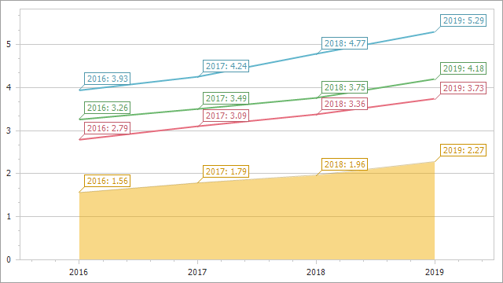

# How to: Simultaneously configures settings for template series and series added to the chart manually. 

Follow the steps below to implement this scenario:

* Create a Windows Forms Application in Visual Studio, and add all [required assemblies](https://docs.devexpress.com/WindowsForms/3160/controls-and-libraries/chart-control/additional-resources/deployment) to the References list of your project.

* Create a [chart](https://docs.devexpress.com/WindowsForms/8117/controls-and-libraries/chart-control) in the _Form1_Load_ event handler. 

* _Populate the chart with autogenerated series:_

     Use the [ChartControl.DataSource](https://docs.devexpress.com/WindowsForms/DevExpress.XtraCharts.ChartControl.DataSource) property to bind the chart to a data source. The custom _GetSeriesTemplateData_ method returns the chart's data in this example. 
     
     Use the [ChartControl.SeriesDataMember](https://docs.devexpress.com/WindowsForms/DevExpress.XtraCharts.ChartControl.SeriesDataMember) property to specify the data field that contains series names.

     Set the [ChartControl.SeriesTemplate.View](https://docs.devexpress.com/CoreLibraries/DevExpress.XtraCharts.SeriesBase.View) property to [LineSeriesView](https://docs.devexpress.com/CoreLibraries/DevExpress.XtraCharts.LineSeriesView) to generate [line](https://docs.devexpress.com/WindowsForms/2976/controls-and-libraries/chart-control/series-views/2d-series-views/point-and-line-series-views/line-chart) series.

* Call the custom _ConfigureSeries_ method with the [ChartControl.SeriesTemplate](https://docs.devexpress.com/WindowsForms/DevExpress.XtraCharts.ChartControl.SeriesTemplate) object passed as a parameter to specify the following settings for all template series: [ArgumentDataMember](https://docs.devexpress.com/CoreLibraries/DevExpress.XtraCharts.SeriesBase.ArgumentDataMember), [ValueDataMembers](https://docs.devexpress.com/CoreLibraries/DevExpress.XtraCharts.SeriesBase.ValueDataMembers), [ArgumentScaleType](https://docs.devexpress.com/CoreLibraries/DevExpress.XtraCharts.SeriesBase.ArgumentScaleType), [ValueScaleType](https://docs.devexpress.com/CoreLibraries/DevExpress.XtraCharts.SeriesBase.ValueScaleType), [LabelsVisibility](https://docs.devexpress.com/CoreLibraries/DevExpress.XtraCharts.SeriesBase.LabelsVisibility), and [Label.TextPattern](xref:DevExpress.XtraCharts.SeriesLabelBase.TextPattern).

*  _Add a single series:_

   Call the [Series(String, ViewType)](https://docs.devexpress.com/CoreLibraries/DevExpress.XtraCharts.Series.-ctor(System.String-DevExpress.XtraCharts.ViewType)) constructor to create a series. Pass the series name and series type as parameters to this method.

   Use the [Series.DataSource](https://docs.devexpress.com/CoreLibraries/DevExpress.XtraCharts.Series.DataSource) property to bind the series to a data source. The custom _GetSeriesData_ method returns the series data.

   Add the series to the [ChartControl.Series](https://docs.devexpress.com/WindowsForms/DevExpress.XtraCharts.ChartControl.Series) collection.

* Call the custom _ConfigureSeries_ method with the series passed as a parameter to specify series settings. 

* Use the [ChartControl.Dock](https://docs.microsoft.com/en-us/dotnet/api/system.windows.forms.control.dock) property to specify the chart position. Call the [Controls.Add](https://docs.microsoft.com/en-us/dotnet/api/system.windows.forms.control.controlcollection.add) method to add the chart to the form.
